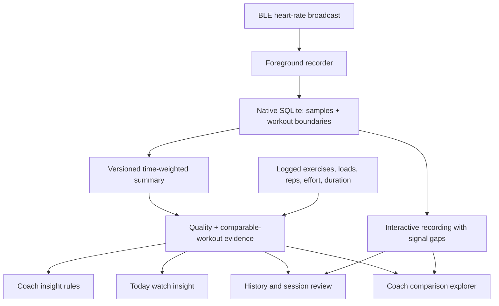

# Watch-informed coaching in M/ARC 39

Heart rate is a shared input to M/ARC's coaching system. Today, Train, the saved-session view, History, and Coach consume the same recording and evidence model.

## Features

- Today has the latest watch-informed observation and a route to Coach.
- Train shows live readings, contact/signal state and prompts for effort ratings. Recording is attached to the stable workout ID.
- Saving a workout updates its compact summary and Coach. The finish screen includes the recording.
- Coach and History Stats share a session explorer. Select a prior workout to see only evidence available at that time.
- The chart shows recorded session averages with outlined markers for limited evidence. It does not join unlike workouts into an implied fitness trend.
- Session traces show BPM against elapsed time, split lines at missing/poor-contact data, a touch/keyboard slider, and set-log timestamps. Markers describe logging times, not exercise onset or exact set attribution.
- Coach combines pulse observations with Easy/Ideal/Max ratings, and explains what was noticed, what it means, and what to review next.

## Measurement contract

Metrics version 2 deduplicates timestamps deterministically, excludes invalid, poor-contact and out-of-workout samples, and caps each reading's represented interval at five seconds or the next packet/end, whichever is earlier. Average BPM is weighted by those intervals. Coverage is captured elapsed time divided by full workout elapsed time. Paused time stays in the recording. Signal gaps count intervals exceeding 15 seconds; the shorter five-second coverage rule is deliberately more conservative.

The peak is the highest accepted recorded sample, not a maximum-heart-rate estimate. No sample, packet gap or unsupported field becomes a zero BPM reading.

Both Java and TypeScript implement the same calculations, with matching regression scenarios. Raw samples remain in native SQLite; only summaries enter the workout state. Browser backup restore can recompute summaries but does not retain native raw traces.

## Coaching policy

A comparison requires valid version-2 evidence, at least 70% capture coverage, at least three minutes captured, and sufficient packets. These are engineering sufficiency rules, not physiological thresholds.

The latest completed workout is matched to at least three earlier, non-overlapping workouts within 42 days: same split and known weighted exercises, same loads/set counts, per-exercise volume within 20%, active and elapsed duration within 25%. Missing historical bodyweight and custom resistance metadata currently prevent matching those workouts. Their recordings still appear for review.

The baseline is the median recorded average. A difference is labelled higher/lower only beyond the larger of eight BPM or 10% of baseline. Effort context needs at least three rated sets and at least half of the session's sets rated. A descriptive observation can suggest reviewing rest lengths, logged effort and conditions; it cannot establish a causal fitness, recovery or readiness change.

Workout edits and deletions recalculate the evidence. Older sessions never use future sessions as controls. Duplicate IDs/time windows cannot manufacture a baseline. Missing, stale, corrupt or partial data explain why a comparison is withheld.

Existing performance-based load progression and muscle recovery rules remain separate from pulse observations. This feature does not infer HRV, calories, training zones, medical warnings or automatic weight/rest adjustments.

## Persistence and lifecycle

SQLite schema 2 preserves explicit workout boundaries and whether they are known. Earlier imported traces without reliable bounds remain unverified until matched with the workout log. Opening the app rehydrates recent summaries from native data and reattaches an active workout.

Backup restore calculates summaries against workout times, preserving leading/trailing missing signal, and replaces native records transactionally before publishing the restored workout state. Active traces retain an unfinished state. Reset clears recording association as well as data. Sensor callbacks and lifecycle mutations are synchronized to prevent writes into a deleted session. Exports omit orphaned traces.

## Validation and evidence

Run `npm run check`, `npm run gate:watch`, and `npm run gate` from `marc-app`. CI additionally compiles/runs `native-tests/HeartRateMetricsTest.java`, then lints/builds the Android APK and verifies the embedded web bundle.

The watch browser gate covers incomplete evidence, matched controls, historical selection, edits/deletions, native bridge trace interaction, five themes and three screen widths. Browser fixtures are test-only.

The restraint in coaching follows measurement evidence: [Bunn et al.'s original validation study](https://pmc.ncbi.nlm.nih.gov/articles/PMC6413847/) found wrist movement affected accuracy in interval/strength conditions; [ACSM's exercise-testing guidance](https://acsm.org/estimating-cardiorespiratory-fitness/) discusses heart-rate measurement/estimation limitations and perceived exertion as supplementary context. Matching thresholds above are product choices, not clinically validated thresholds.

A physical phone/watch test remains necessary for vendor compatibility, screen-off recording and actual sensor behavior. See [the hardware checklist](HARDWARE-TEST.md).
